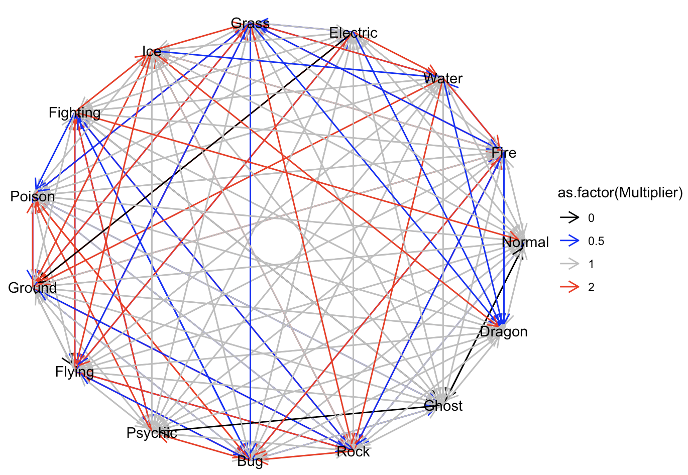
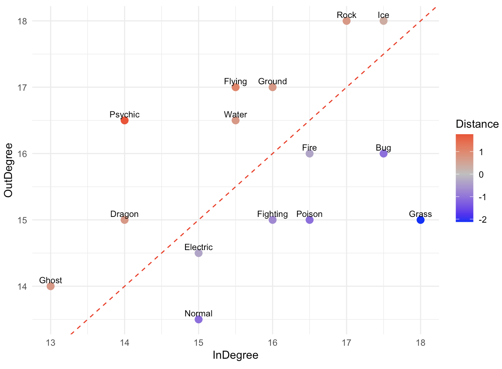
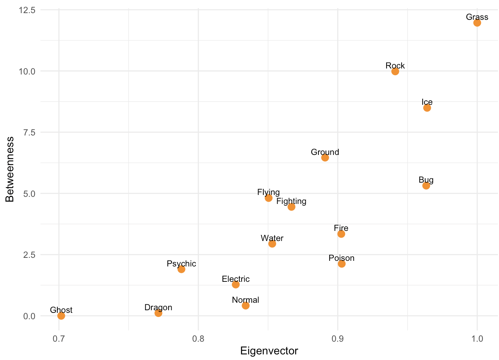

## 概要

データ分析・ゲーム制作・学術研究での成果物をまとめています。

・データ分析：[type_analysis.md](02_data_analysis/type_analysis.md)　

・ゲーム制作：[type_card_battle.md](03_programming/type_card_game/type_card_battle.md) 

・学術研究：[01_seminar](01_seminar)

## プロジェクトの概要

### ① 対戦型RPGのタイプ相性ネットワーク分析(データ分析作品)

対戦型RPGのタイプ相性についてネットワーク分析を行い、「ゲームバランス」という曖昧な概念をスコア化・評価しました。

・解説資料：[type_analysis_material(simple_version).pdf](02_data_analysis/type_analysis_material(simple_version).pdf)

・分析チュートリアル：https://rikuli-35.github.io/seminar-materials/02_data_analysis/type_analysis_tutorial.html

  
  
  

### ② タイプ相性カードゲームの制作（ゲーム作品）

対戦型RPGのタイプ相性をテーマとしたカードゲームを制作しました。

・解説資料(設計思想)：[type_card_battle_material(simple_version).pdf](03_programming/type_card_game/main/type_card_battle2_1.pdf)

### ③学習分析(学術研究)

学習者の学習履歴から「いつ」課題に取り組んだのかを分析しました。

・解説資料：[JASLA2025.pdf](01_seminar/JASLA2025.pdf)

## 使用環境

  
  
  
  

R言語：RStudio(macOS/Windows)

C/C++言語：Visual Studio Code

UI(ゲーム制作)：raylib

---
